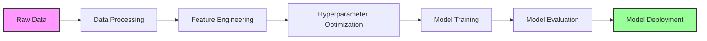
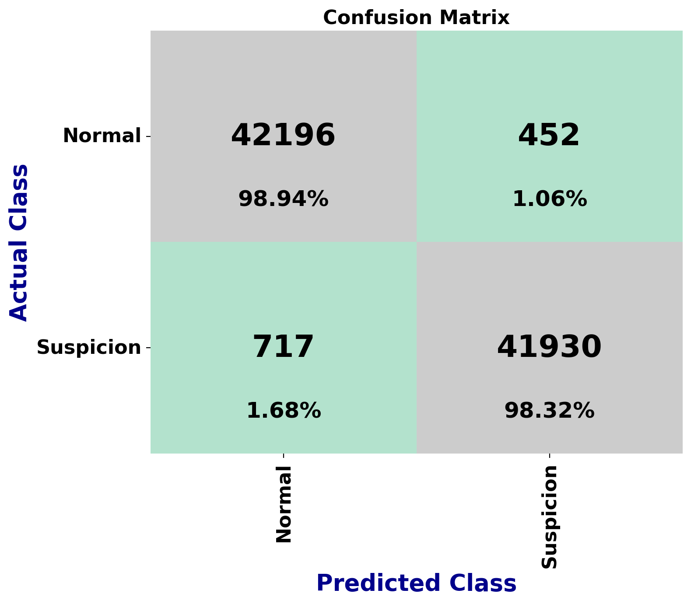
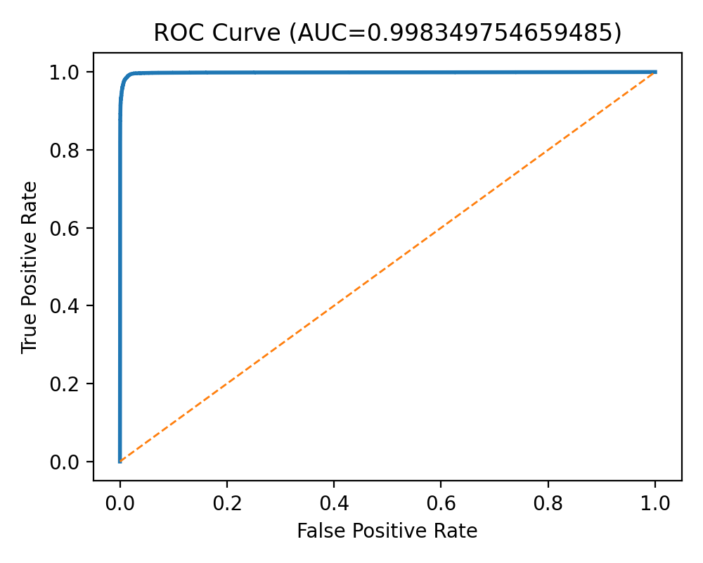
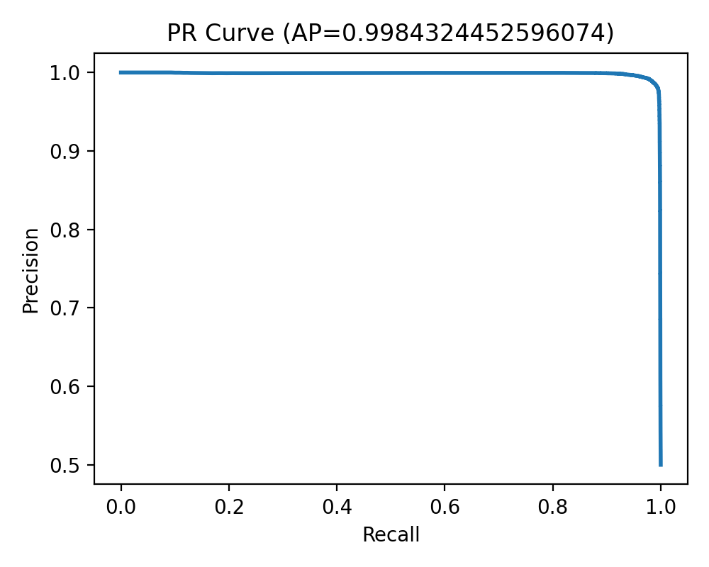

# 🔍 MLOps End-to-End: Credit Card Fraud Detection

[](https://python.org)
[](https://pytorch.org)
[](https://mlflow.org)
[](https://dvc.org)
[](https://www.docker.com)
[](LICENSE)

A production-ready MLOps pipeline for credit card fraud detection using deep learning, featuring automated hyperparameter optimization, experiment tracking, and data versioning.

---

## 🎯 Project Overview

This repository implements a complete end-to-end machine learning operations (MLOps) pipeline for detecting fraudulent credit card transactions. The project demonstrates modern ML engineering practices with automated workflows, reproducible experiments, and comprehensive model tracking.

### ✨ Key Features

- **Deep Learning Model**: GRU (Gated Recurrent Unit) neural network for sequence-style modeling
- **Hyperparameter Optimization**: Optuna-powered search (configurable trials: 15–100+)
- **Experiment Tracking**: Full MLflow integration (local or remote, e.g., DagHub)
- **Data Versioning**: DVC-managed artifacts and reproducible pipelines
- **Robust Evaluation**:
  - Feature-schema alignment (enforces the exact training column order)
  - BN/LN auto-detect (loads BatchNorm or LayerNorm checkpoints safely)
  - Positive-class auto-detection (chooses the correct logit via ROC-AUC)
  - Threshold sweep to maximize F1 / analyze precision–recall trade-offs
- **Production Ready**: YAML-configured, containerizable, and deployment-friendly

---

## 🏗️ Architecture



**Backbones**:
- **DVC** for data/pipeline versioning
- **MLflow** for optimization/training/evaluation tracking
- **Optuna** for HPO

---

## 📁 Repository Structure

```
MLOps_End_to_End/
├── 📂 Data/
│   ├── processed/                   # DVC-tracked processed datasets
│   └── raw/                         # Raw credit card transaction data
├── 📂 data_src/                     # EDA & analysis
│   ├── EDA.ipynb
│   ├── data_inspection.py
│   ├── missing_values_analysis.py
│   └── multivariate_analysis.py
├── 📂 src/
│   ├── train.py                     # GRU training with Optuna + MLflow
│   ├── evaluate.py                  # Robust evaluator (schema, BN/LN, threshold sweep)
│   ├── feature_selection.py
│   └── __init__.py
├── 📂 models/                       # Trained models + metadata (DVC/MLflow artifacts)
│   ├── best_fraud_detection_model.pth
│   └── model_info.json              # feature_names, label_col, best_params, etc.
├── 📂 optuna_study/                 # Study summary/artifacts
├── 📂 mlruns/                       # Local MLflow store (if using file backend)
├── 📂 reports/                      # Evaluation reports and visualizations
├── params.yaml                      # Pipeline configuration
├── dvc.yaml                         # DVC pipeline definition
├── run_training.py                  # (Optional) training entrypoint
├── requirements.txt                 # Dependencies
└── README.md                        # This file
```

> **Note**: `models/model_info.json` includes the `feature_names` (training column order), `label_col`, `num_classes`, `best_params`, and (optionally) the source MLflow run id. The evaluator uses this to guarantee train/eval consistency.

---

## 🚀 Quick Start

### 1️⃣ Clone & Setup

```bash
git clone https://dagshub.com/Arupreza/MlOps_End_to_End.git
cd MlOps_End_to_End
python -m venv venv && source venv/bin/activate  # Linux/Mac
# python -m venv venv && venv\Scripts\activate     # Windows
pip install -r requirements.txt
```

### 2️⃣ (Optional) Initialize DVC

```bash
dvc init
dvc remote add -d origin https://dagshub.com/Arupreza/MlOps_End_to_End.dvc
dvc pull
```

### 3️⃣ Train (with Optuna)

```bash
# Runs Optuna optimization (e.g., 15 trials in train.py),
# logs to MLflow, and writes:
# - models/best_fraud_detection_model.pth
# - models/model_info.json (feature schema + params)
python src/train.py
```

> You can change the number of trials in `src/train.py` via `n_trials` parameter.

### 4️⃣ Evaluate

```bash
# Auto-discovers model + metadata, enforces feature order, logs to MLflow,
# and saves artifacts to reports/eval/<timestamp>/
python src/evaluate.py
```

**Generated Artifacts:**
- `metrics.json`, `classification_report.txt`, `predictions.csv`
- `confusion_matrix.png`, `roc_curve.png`, `pr_curve.png`
- `threshold_sweep.csv` (binary)

### 5️⃣ Monitor Experiments

```bash
# Local UI
mlflow ui
```

Or configure a remote MLflow (e.g., DagHub) via environment variables:
```bash
export MLFLOW_TRACKING_URI=...
export MLFLOW_TRACKING_USERNAME=...
export MLFLOW_TRACKING_PASSWORD=...
```

---
## 🐳 Docker Usage

This project ships with a production-ready `Dockerfile` for containerized deployment of the Streamlit evaluation app.

### 🔨 Build the Image

From the project root:

```bash
docker build -t arupreza/fraud-eval-app:latest .
```

### ▶️ Run the App

**Option A — With baked-in models/data**  
If you copied `models/` and `Data/processed/` into the image:

```bash
docker run -d --name fraud-app -p 8501:8501 arupreza/fraud-eval-app:latest
```

Then open http://localhost:8501.

**Option B — Mount host models/data**  
Keep the image slim and mount from host:

```bash
docker run -d --name fraud-app \
  -p 8501:8501 \
  -v $(pwd)/models:/app/models \
  -v $(pwd)/Data/processed:/app/Data/processed \
  -e TEST_DATA_PATH=/app/Data/processed/creditcard_processed_test.csv \
  arupreza/fraud-eval-app:latest
```

On **Windows PowerShell**:

```powershell
docker run -d --name fraud-app `
  -p 8501:8501 `
  -v C:\Users\rezan\Arupreza\MlOps_End_to_End\models:/app/models `
  -v C:\Users\rezan\Arupreza\MlOps_End_to_End\Data\processed:/app/Data/processed `
  -e TEST_DATA_PATH=/app/Data/processed/creditcard_processed_test.csv `
  arupreza/fraud-eval-app:latest
  
## 🔬 Latest Model Performance

Evaluated on `Data/processed/creditcard_processed_test.csv` using the robust evaluator.

### 📊 Overall Metrics
| Metric | Score |
|--------|-------|
| **Accuracy** | 0.9863 |
| **Precision (weighted)** | 0.9863 |
| **Recall (weighted)** | 0.9863 |
| **F1 (weighted)** | 0.9863 |
| **ROC-AUC** | 0.99835 |
| **PR-AUC** | 0.99843 |
| **Best Threshold (F1 sweep)** | 0.08 |

### 🎯 Class-wise Performance (argmax)
| Class | Precision | Recall | F1-Score | Support |
|-------|-----------|--------|----------|---------|
| **Class 0 (Normal)** | 0.9833 | 0.9894 | 0.9863 | 42,648 |
| **Class 1 (Fraud)** | 0.9893 | 0.9832 | 0.9863 | 42,647 |

## 📊 Model Performance Visualizations

### Confusion Matrix


### ROC Curve


### Precision-Recall Curve


### 🔍 Evaluator Highlights
- ✅ Uses training feature order from `models/model_info.json`
- ✅ Auto-detects BatchNorm vs LayerNorm checkpoints
- ✅ Picks correct positive logit via ROC-AUC (guards label/score inversions)
- ✅ Performs threshold sweep and reports the best-F1 operating point

---

## 📊 Experiment Tracking

All experiments are tracked via MLflow and can be viewed locally or on DagHub.

- **Configurable Hyperparameter Trials** (Optuna)
- **Model Versioning & Artifacts** (checkpoints, plots, metadata)
- **Metrics Dashboard** (train/val + evaluation)

**Example MLflow tags**: `phase=evaluation`, `dataset=creditcard_processed_test.csv`, `norm_type={batch|layer}`

---

## 🔧 Configuration

### `params.yaml` Example

```yaml
model:
  num_classes: 2

optuna:
  n_trials: 50
  timeout: null

training:
  final_epochs: 40
  early_stopping_patience: 10

mlflow:
  experiment_name: "credit_card_fraud_detection"
  tracking_uri: "https://dagshub.com/Arupreza/MlOps_End_to_End.mlflow"
```

---

## 📈 Pipeline Stages

### Stage 1: Data Preparation
- Clean/split/scale datasets under `Data/processed/`
- Keep a consistent label column (`Class` by default)

### Stage 2: Hyperparameter Optimization
- Optuna search with MLflow logging
- Best trial artifacts in `optuna_artifacts/`

### Stage 3: Model Training
- GRU + LayerNorm (by default)
- Early stopping + gradient clipping
- Class weights for imbalance

### Stage 4: Robust Evaluation
- Schema-aligned evaluation
- BN/LN auto-compatibility
- Positive-class detection + threshold sweep
- MLflow + local artifacts

---

## 🛠️ Development

### Extend the Model
- Edit `src/train.py` (architecture/hparams)
- Adjust Optuna search spaces
- Add metrics to MLflow logs

### Add New Features
1. Update `params.yaml` or code
2. Modify `dvc.yaml` pipeline
3. Run `dvc repro`
4. Track results in MLflow

---

## 🧩 Troubleshooting

| Issue | Solution |
|-------|----------|
| **Great val, poor test** | Likely feature order mismatch or wrong checkpoint. Ensure `models/model_info.json` exists and `models/best_fraud_detection_model.pth` points to your best weights. |
| **state_dict keys mismatch (bn vs ln)** | Evaluator auto-detects BN/LN; re-run `python src/evaluate.py`. |
| **All-one-class predictions** | Open `reports/eval/.../metrics.json`: <br>• `diagnostics.feature_mismatch` should show no missing features <br>• `chosen_pos_index` indicates which logit column is treated as positive |

---

## 🤝 Contributing

1. **Fork** the repository
2. Create your feature branch: `git checkout -b feature/amazing-feature`
3. Commit your changes: `git commit -m "Add amazing feature"`
4. Push to the branch: `git push origin feature/amazing-feature`
5. Open a **Pull Request**

---

## 📄 License

This project is licensed under the MIT License - see the [LICENSE](LICENSE) file for details.

---

## 🙏 Acknowledgments

- [MLflow](https://mlflow.org) for experiment tracking
- [DVC](https://dvc.org) for data versioning & pipelines
- [Optuna](https://optuna.org) for hyperparameter optimization
- [DagHub](https://dagshub.com) for hosted MLOps
- [PyTorch](https://pytorch.org) for deep learning

---

## 📞 Contact

**Arupreza** — [GitHub](https://github.com/Arupreza)  
**Project Link** — [DagHub Repository](https://dagshub.com/Arupreza/MlOps_End_to_End)

---

<div align="center">

**⭐ If this project helps you, please star the repo!**

[](https://star-history.com/#Arupreza/MlOps_End_to_End&Date)


</div>